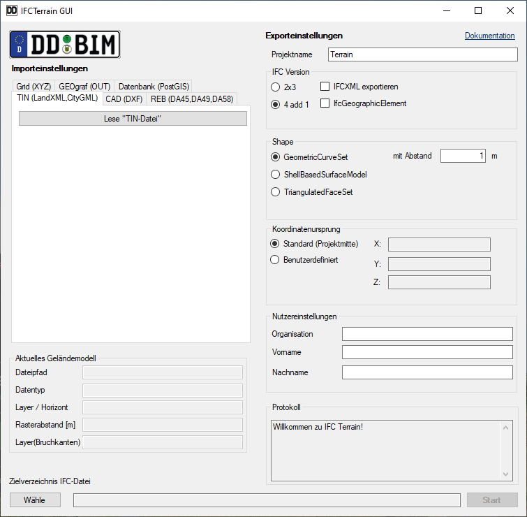
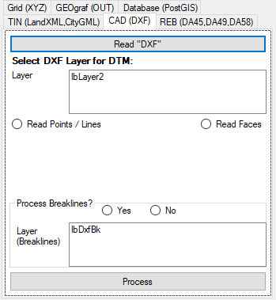
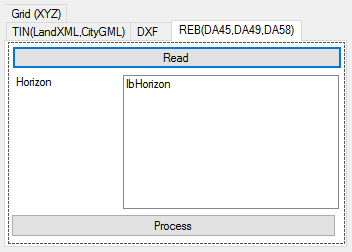
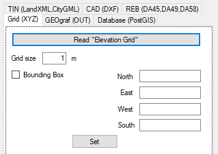
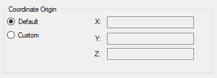
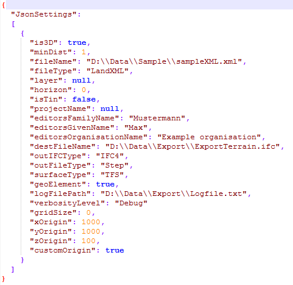

# IFCTerrain Documentation


This document provides description and explains the functionality of the IFCTerrain software tool. The main purpose of IFCTerrain is transforming terrain models of different data formats into IFC (Industry Foundation Classes), which is the common open data exchange format in BIM (Building Information Modeling).


[TOC]


## Terrain models in IFC


The IFC data format provides multpiple ways to store terrain information. The following subsections contain explanations for these terrain model concepts in IFC, that are supported by IFCTerrain.


### IfcGeometricCurveSet


According to the entity definition, "The IfcGeometricCurveSet is used for the exchange of shape representation of a collection of (2D or 3D) points and curves only".

It contains a list of elements that form the shape representation of the IfcGeometricCurveSet object. Contrary to the IfcGeometricSet from which it inherits the element list, IfcGeometricCurveSet can not have surface objects in its geometric set. It consists stricly of points and curves as stated above.


https://standards.buildingsmart.org/IFC/RELEASE/IFC4/ADD2_TC1/HTML/schema/ifcgeometricmodelresource/lexical/ifcgeometriccurveset.htm


### IfcShellBasedSurfaceModel


IfcShellBasedSurfaceModel represents a shape by a set of open or closed shells. The singular shells themselves have a dimensionality of 2 and shall not overlap each other. The complete IfcShellBasedSurfaceModel has a dimensionality of 3.


https://standards.buildingsmart.org/IFC/DEV/IFC4_2/FINAL/HTML/schema/ifcgeometricmodelresource/lexical/ifcshellbasedsurfacemodel.htm


### IfcTriangulatedFaceSet


From the buildingsmart IFc documentation:


>  The IfcTriangulatedFaceSet is a tessellated face set with all faces being bound by triangles. The faces are constructed by implicit polylines defined by three Cartesian points. The coordinates of each point are provided by an index into an ordered list of Cartesian points provided by the two-dimensional list CoordIndex, where

> - the first dimension of the two-dimensional list addresses the list of triangular faces

> - the second dimension of the two-dimensional list provides exactly three indices into the IfcCartesianPointList referenced by Coordinates defined at the supertype IfcTessellatedFaceSet. Each index points to a Cartesian point being a vertex of the triangle.

The type IfcTriangulatedFaceSet is only available in schema IFC4 and not in IFC2x3.

http://docs.buildingsmartalliance.org/MVD_SPARKIE/schema/ifcgeometricmodelresource/lexical/ifctriangulatedfaceset.htm


## The IFCTerrain tool





### Import settings


The main window of the IfcTerrain tool is seperated in import and export settings.

In tool is able to import the following data types containing terrain information:


- LandXML and CityGML containing TIN-Data

- Drawing Interchange File Format (DXF) containing points and lines OR faces

	- With DXF the user has to select the layer in which the terrain information is stored and wether the terrain information consists of points and/or lines OR faces and then click process to correctly import the data





- REB data (formats DA45, DA49 or DA58)

	- similar with DXF, in the REB import the user has to select the horizon in which the terrain data is stored and then click process to correctly import the data





- Grid, specifically an elevation grid consisting of points and a regular size of the grid "tiles" (simple .xyz data format)

	- the user has to select the correct grid size used in the file





### Export settings


Under export settings, the user can customize the IFC file that will be generated by the IFCTerrain tool.


#### IFC Version

Within the IFCVersion box, the user can decide:

- between IFCVersions "2x3" and "4 add 1"

- if IfcGeographicElement entities shall be exportet (only available if IFC Version 4 add 1 is selected)

- if a regular IFC file in STEP format or IFCXML in XML format (Export IFC Checkbox checked) shall be generated


#### Export shape and model


Within the "Shape" box, the user can decide between the different possibilities to store the terrain information in IFC (as mentioned above in the chapter "Terrain models in IFC"). Keep in mind that not every BIM software is able to represent these different models in the same way. Which model type should be exported depends on the software that the generated Ifc file shall be imported in.

Additionaly the user has the choice to define a minimum distance between points that is allowed in the final mesh of the terrain model. For beginner users this input should be left at its standard value of 1 meter.


#### Coordinate Origin


The coordinate origin box provides the opportunity to customize the coordinate origin of the exported IFC file. Selecting "default" will place the coordinate origin in the middle of the total project area and stored in the IfcSite entity. All of the absolute input coordinates will be transformed in relation to this coordinat origin.

The "custom" option allows the user to define the project coordinate origin to a position of his/her choice.





### Generating IFCTerrain data using command line arguments


As an alternative to the graphical user interface, it is possible to use the IFCTerrainCommand.exe for generating terrain models in IFC format. For that, a *.json file is required, that contains the information that is required to run the application.

Below are an example for such a json file and a table containing descriptions for every possible attribute.




| attribute | value range | description |
|--------|--------|--------|
|is3D|true; false|Describes wether the generated terrain model should be 3-dimensional or not|
|minDist|Double|Sets the minimum distance between nodes in the terrain model|
|fileName|valid filepath-string|Path and filename of the input file|
|fileType|LandXML; CityGML; DXF; REB; Grid [string]|Fileformat of the input file|
|layer|String|Name of the layer that contains terrain information in an input DXF file|
|horizon|Integer|Number of the horizon that contains terrain information in an input REB file|
|isTin|true; false|Describes wether an input DXF file contains tin information (faces) or not|
|projectName|String|The project name in the output IFC file|
|editorsFamilyName|String|The editors family name in the output IFC file|
|editorsGivenName|String|The editors given name in the output IFC file|
|editorsOrganisation|String|The editors organisation name in the output IFC file|
|destFileName|valid filepath-string|Path and filename of the output file|
|outIFCType|IFC2x3; IFC4|Sets the IFC version of the output file|
|outFileType|Step; XML|Sets the file fomrat of the output file|
|surfaceType|GCS; SBSM; TFS|Sets the terrain model type for the output IFC file: GCS=GeometricCurveSet; SBSM=ShellBasesSurfaceModel; TFS=TriangulatedFaceSet|
|geoElement|true; false|Setting, that decides wether the output IFC file should contain an IfcGeographicElement of the terrain or not|
|gridSize|Integer|The distance between points in the grid input file|
|customOrigin|true; false|Describes wether the project coordinat origin should be set to the user defined position or not|
|xOrigin|Double|The x component of the custom origin|
|yOrigin|Double|The y component of the custom origin|
|zOrigin|Double|The z component of the custom origin|


Once the input json file is ready one can use the console (cmd) to run the IFCTerrainCommand.exe with the filepath of the input json file as a command line argument. For Example:


```
IFCTerrainCommand.exe "D:\Data\input\Sample.json"
```

## Usability of generated IFC files in other software

Keep in mind that IFCTerrain generates IFC files according to the specified standards of buildingSMART. Unfortunately not every software that works with IFC files is able to interpret these files completely. The following part contains information on how some available software can interpret IFCTerrain-generated IFC files.

### Revit

If you want to use the terrain data with correct coordinates it is important to place the "project base point" at the desired location (same as coordinate origin of IFCTerrain file) before importing the generated IfcTerrain file in Revit.

Furthermore Revit is currently unable to display IfcTriangulatedFaceSet entities.

### Solibri

Solibri generally imports almost all IFC information correctly, but is currently unable to display IfcGeometricCurveSet entities.